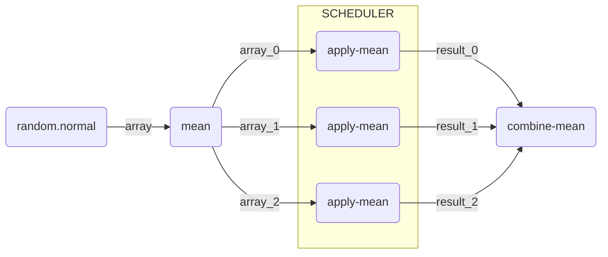

---
kernelspec:
  name: python3
  display_name: Python 3 (ipykernel)
  language: python
---

# Parallel and Larger-than-Memory Processing

**Authors:** Ian Carroll (NASA, UMBC)

<div class="alert alert-success" role="alert">

<!-- FIXME -->
The following notebooks are **prerequisites** for this tutorial.

- Learn with OCI: [Data Access][oci-data-access]
- Learn with OCI: [Processing with Command-line Tools][oci-ocssw-processing]
- Learn with OCI: [Project and Format][oci-project-and-format]

</div>

## Summary

Processing a large collection of PACE granules can seem like a big job!
The best way to approach a big job is by breaking it into many small jobs, and then putting all the pieces back together again.
The reason we break up big jobs has to do with computational resources, specifically memory (i.e. RAM) and processors (i.e. CPUs or GPUs).
That large collection of granules can't all fit in memory; and even if it could, your computation might only use one processor.

This notebook works toward a better understanding of a tool tightly integrated with XArray that breaks up big jobs.
The tool is [Dask: a Python library for parallel and distributed computing][dask].

<!-- TODO: elaborate on Dask -->

## Learning Objectives

At the end of this notebook you will know:

- About the framework we're calling "chunk-apply-combine"
- How to start a `dask` client for parallel and larger-than-memory pipelines
- One method for averaging Level-2 "swath" data over time

## Contents

1. [Setup](#1.-Setup)
1. [Chunk-Apply-Combine](#2.-Chunk-Apply-Combine)
1. [Dask Workers](#3.-Dask-Workers)
1. [Level-2 Averaging](#4.-Level-2-Averaging)

[oci-data-access]: https://oceancolor.gsfc.nasa.gov/resources/docs/tutorials/notebooks/oci_data_access
[oci-ocssw-processing]: https://oceancolor.gsfc.nasa.gov/resources/docs/tutorials/notebooks/oci-ocssw-processing
[dask]: https://docs.dask.org

+++

## 1. Setup

Begin by importing all of the packages used in this notebook. If your kernel uses an environment defined following the guidance on the [tutorials] page, then the imports will be successful.

[tutorials]: https://oceancolor.gsfc.nasa.gov/resources/docs/tutorials/

```{code-cell} ipython3
import cartopy.crs as ccrs
import dask.array as da
import earthaccess
import matplotlib.pyplot as plt
import numpy as np
import pyproj
import xarray as xr
from dask.distributed import Client
from matplotlib.patches import Rectangle
```

```{code-cell} ipython3
#import rasterio
#import rioxarray as rio
```

<!-- TODO rio packages -->

We will discuss `dask` in more detail below, but we use several additional packages that are worth their own tutorials:
- `pyproj` is a database and suite of algorithms for converting between geospatial coordinate reference systems
- `rasterio` is a high-level wrapper for GDAL which provides the ability to "warp" with the type of geolocation arrays distributed in Level-2 data.

[SatPy](https://satpy.readthedocs.io/) is another Python package that could be useful for the processing demonstrated in this notebok, especially through its [Pyresample](https://pyresample.readthedocs.io/) toolking. SatPy requires dedicated readers for any given instrument, however, and we have not tested the [SatPy reader contributed for PACE/OCI].

The data used in the demonstration is the `chlor_a` product found in the BGC suite of Level-2 ocean color products from OCI.

[SatPy reader contributed for PACE/OCI]: https://satpy.readthedocs.io/en/stable/api/satpy.readers.pace_oci_l1b_nc.html

```{code-cell} ipython3
bbox = (-77, 36, -73, 41)
results = earthaccess.search_data(
    short_name="PACE_OCI_L2_BGC",
    temporal=("2024-08-01", "2024-08-07"),
    bounding_box=bbox,
)
len(results)
```

The search results include all granules from launch through July of 2024 that intersect a bounding box around the Chesapeake and Delaware Bays. The region is much smaller than an OCI swath, so we do not use the cloud cover search filter which considers the whole swath.

```{code-cell} ipython3
results[0]
```

```{code-cell} ipython3
paths = earthaccess.open(results[:1])
```

```{code-cell} ipython3
datatree = xr.open_datatree(paths[0], decode_timedelta=False)
dataset = xr.merge(datatree.to_dict().values())
dataset
```

As a reminder, the Level-2 data has latitude and longitude arrays that give the geolocation of every pixel. The `number_of_line` and `pixels_per_line` dimensions don't have any meaningful coordinates that would be useful for stacking Level-2 files over time.  In a lot of the granules, like the one visualized here, there will be a tiny amount of data within the box. But we don't want to lose a single pixel (if we can help it)!

```{code-cell} ipython3
fig = plt.figure(figsize=(8, 4))
axes = fig.add_subplot()
dataset = dataset.set_coords(("latitude", "longitude"))
artist = dataset["chlor_a"].plot.pcolormesh(
    x="longitude", y="latitude", robust=True, ax=axes
)
axes.add_patch(
    Rectangle(
        bbox[:2],
        bbox[2] - bbox[0],
        bbox[3] - bbox[1],
        edgecolor="red",
        facecolor="none",
    )
)
axes.set_aspect("equal")
plt.show()
```

When we get to opening mulitple datasets, we will use a helper function to prepare the datasets for concatenation.

```{code-cell} ipython3
def time_from_attr(ds):
    """Set the start time attribute as a dataset variable.

    Parameters
    ----------
    ds
        a dataset corresponding to a Level-2 granule
    """
    datetime = ds.attrs["time_coverage_start"].replace("Z", "")
    ds["time"] = ((), np.datetime64(datetime, "ns"))
    ds = ds.set_coords("time")
    return ds


def trim_number_of_lines(ds):
    """Exclude the last scan line for easier stacking.

    Parameters
    ----------
    ds
        a dataset corresponding to a Level-2 granule
    """
    ds = ds.isel({"number_of_lines": slice(0, 1709)})
    return ds
```

Before we get to data, we will play with some random numbers. Whenever you use random numbers, a good practice is to set a fixed but unique seed, such as the result of `secrets.randbits(64)`.

```{code-cell} ipython3
random = np.random.default_rng(seed=5179916885778238210)
```

[back to top](#contents) <a name="section-name"></a>

+++

## 3. Chunk-Apply-Combine

If you've done big data processing, you've probably come across the "split-apply-combine" or "map-reduce" frameworks.
A simple case is computing group-wise means on a dataset where one variable defines the group and another variable is what you need to average for each group.

1. **split**: divide a table into smaller tables, one for each group
2. **apply**: calculte the mean on each small table
3. **combine**: reassemble the results into a table of group-wise means

The same framework is also used without a natural group by which a dataset should be divided.
The split is on equal-sized slices of the original dataset, which we call "chunks".
Rather than a group-wise mean, you could use "chunk-apply-combine" to calculate the grand mean in chunks.

1. **chunk**: divide the array into smaller arrays, or "chunks"
2. **apply**: calculate the mean and sample size of each chunk (i.e. skipping missing values)
3. **combine**: combine the size-weighted means to compute the mean of the whole array

The apply and combine steps have to be capable of calculating results on a slice that can be combined to equal the result you would have gotten on the full array. If a computation can be shoved through "chunk-apply-combine" (see also "map-reduce"), then we can process an array that is too big to read into memory at once. We can also distribute the computation across processors or across a cluster of computers.

We can represent the framework visually using a task graph, a collection of functions (nodes) linked through input and output data (edges).

<!-- TODO: functions imported form numpy vs imported from dask -->

+++


+++

The output of the `random.normal` function becomes the input to the `mean` function. We can decide to use chunk-apply-combine
if either:

1. `array` is going to be larger than available memory
1. `mean` can be accurately calculated from intermediate results on slices of `array`

+++

By the way, `numpy` arrays have an `nbytes` attribute that helps you understand how much memory you may need. Note tha most computations require several times the size of an input array to do the math.

```{code-cell} ipython3
array = random.normal(1, 2, size=2**24)
array
```

```{code-cell} ipython3
print(f"{array.nbytes / 2**20} MiB")
```

It's still not too big to fit in memory on most laptops. For demonstration, let's assume we could fit a 1.0 GiB array into memory, but not a 3 GiB array. We will calculate the mean of a 3 GiB array, using 3 splits each of size 1 GiB in a serial pipeline. (Simultaneously calculating the standard deviation is left as an exercise for the reader.)


A simple way to measure performance (i.e. speed) in notebooks is to use the [IPython %%timeit magic][timeit].
Begin any cell with `%%timeit` on a line by itself to trigger that cell to run many times under a timer.
How long it takes the cell to run on average will be printed along with any result.

On this system, the serial approach takes between 8 and 9 seconds.

<!-- TODO fixe sizes and timing, 8 times the 128 MiB array for 1 GiB -->

[timeit]: https://ipython.readthedocs.io/en/stable/interactive/magics.html#magic-timeit

```{code-cell} ipython3
%%timeit -r 3

n = 8
s = 0
for _ in range(n):
    array = random.normal(1, 2, size=2**24)
    s += array.mean()
mean = s / n
```

All we were able to implement was serial computation, but we have multiple processors availble. When we visualize the task graph for the computation, it's apparent that running the calculation serially might not have been the most performant strategy.

+++



+++

In this task graph, the `mean` function is never used! Somehow, the `apply-mean` function and `combine-mean` deviation functions have to be defined. This is another part of what Dask provides.

<!-- FIXME -->

```{code-cell} ipython3
client = Client(n_workers=2, memory_limit="512MiB")
client
```

```{code-cell} ipython3
dask_random = da.random.default_rng(random)
```

```{code-cell} ipython3
:scrolled: true

dask_array = dask_random.normal(1, 2, size=2**27)#)
dask_array
```

```{code-cell} ipython3
dask_array.mean()
```

```{code-cell} ipython3
%%timeit -r 3

mean = dask_array.mean().compute()
```

We just demonstrated two ways of doing larger-than-memory calculations.

Our synchronous implemenation (using a for loop) took the strategy of maximizing the use of available memory while processing one chunk: so we used 1 GiB chunks, requiring 3 chunks to get to a 3 GiB array.

Our concurrent implementation (using `dask.array`), took the strategy of maximizing the use of available processors: so we used small chunks of 32 MiB, requiring many chunks to get to a 3 GiB array.

The concurrent implementation was a little more than twice as fast.

```{code-cell} ipython3
client.close()
```

## 4. Stacking Level-2 Granules

The integration of XArray and Dask is designed to let you work without doing very much different. Of course, there is still a lot of work to do when writing any processing
pipeline on a collection of Level-2 granules. Stacking them over time, for instance, may
sound easy but requires resampling the data to a common grid. This section demonstrates
one method for stacking Level-2 granules.

1. Choose a projection for a common grid
1. Get geographic coordinates that correspond to the projected coordinates
1. Resample each granule to the new coordinate
1. Stack results along the time dimension

Use `pyproj` for the first two steps, noting that the EPSG code of the coordinate reference system (CRS) of the Level-2 files is not recorded in the files. Know that it is the universal default for a CRS with latitudes and longitudes: "EPSG:4326".

+++

Notice that using `xr.open_mfdataset` automatically triggers the use of `dask.array` instead of `numpy` for the variables. To get a dashboard, load up the Dask client.

<!-- FIXME -->

```{code-cell} ipython3
client = Client()
client
```

```{code-cell} ipython3
aoi = pyproj.aoi.AreaOfInterest(*bbox)
```

```{code-cell} ipython3
pyproj.CRS.from_epsg(4326)
```

The `pyproj` database contains all the UTM grids and helps us choose the best one for our AOI.

```{code-cell} ipython3
crs_list = pyproj.database.query_utm_crs_info(
    datum_name="WGS 84", area_of_interest=aoi, contains=True
)
for i in crs_list:
    print(i.auth_name, i.code, ": ", i.name)
```

```{code-cell} ipython3
pyproj.CRS.from_epsg(32618)
```

Note that the axis order for EPSG:4326 is ("Lat", "Lon"), which is "backwards" from the "X", "Y" used by EPSG:32618. When we use a CRS transformer, this defines the order of arguments.

```{code-cell} ipython3
t = pyproj.Transformer.from_crs("EPSG:4326", "EPSG:32618", area_of_interest=aoi)
```

```{code-cell} ipython3
x_min, y_min = t.transform(aoi.south_lat_degree, aoi.west_lon_degree)
x_min, y_min
```

```{code-cell} ipython3
x_max, y_max = t.transform(aoi.north_lat_degree, aoi.east_lon_degree)
x_max, y_max
```

Instead of opening a single granule with `xr.open_dataset`, open all of the granules with `xr.open_mfdataset`. Use the `time_from_attr` function defined above to populate a `time` coordinate from the attributes on each granule.

```{code-cell} ipython3
paths = earthaccess.open(results)
```

```{code-cell} ipython3
kwargs = {"combine": "nested", "concat_dim": "time"}
prod = xr.open_mfdataset(paths, preprocess=time_from_attr, **kwargs)
prod
```

```{code-cell} ipython3
nav = xr.open_mfdataset(
    paths, preprocess=trim_number_of_lines, group="navigation_data", **kwargs
)
sci = xr.open_mfdataset(
    paths, preprocess=trim_number_of_lines, group="geophysical_data", **kwargs
)
dataset = xr.merge((prod, nav, sci))
dataset
```

Disclaimer: the most generic function that we have available to resample the dataset is `scipy.interpolate.griddata`. This is not specialized for geospatial resampling, so there is likely a better way to do this using `pyresample` or `rasterio.warp`.

Due to limitations of `griddata` however, we have to work in a loop. For each slice over the time dimension (i.e. each file), the loop is going to collect that latitudesa and longitudes as `swath_latlon`, resample to `grid_latlon` (which has regular spacing in the projected CRS), and store the result in a list of `xr.DataArray`.

```{code-cell} ipython3
groups = []
for key, value in dataset.groupby("time"):
    value = value.squeeze("time")
    swath_pixel = value.stack(
        {"point": ["number_of_lines", "pixels_per_line"]}, create_index=False
    )
    swath_latlon = (
        swath_pixel[["latitude", "longitude"]]
        .to_dataarray("axis")
        .transpose("point", ...)
    )
    gridded = griddata(swath_latlon, swath_pixel["chlor_a"], grid_latlon)
    gridded = xr.DataArray(gridded, dims="point")
    gridded = gridded.expand_dims({"time": [key]})
    groups.append(gridded)
```

```{code-cell} ipython3
groups[-1]
```

Then there is the final step of getting the whole collection concatenated together and associated with the projected CRS (the `x` and `y` coordinates).

```{code-cell} ipython3
grid_point["chlor_a"] = xr.concat(groups, dim="time")
dataset = grid_point.unstack()
dataset
```

After viewing a map at individual time slices in projected coordinates, you can decide what to do for your next step of analysis. Some of the granules will have good coverage, free of clouds.

```{code-cell} ipython3
dataset_t = dataset.isel({"time": 4})
```

```{code-cell} ipython3
fig = plt.figure()
crs = ccrs.UTM(18, southern_hemisphere=False)
axes = plt.axes(projection=crs)
artist = dataset_t["chlor_a"].plot.imshow(x="x", y="y", robust=True, ax=axes)
axes.gridlines(draw_labels={"left": "y", "bottom": "x"})
axes.coastlines()
plt.show()
```

Many will not, either because of clouds or because only some portion of the specified bounding box is within the given swath.

```{code-cell} ipython3
dataset_t = dataset.isel({"time": 8})

fig = plt.figure()
crs = ccrs.UTM(18, southern_hemisphere=False)
axes = plt.axes(projection=crs)
artist = dataset_t["chlor_a"].plot.imshow(x="x", y="y", robust=True, ax=axes)
axes.gridlines(draw_labels={"left": "y", "bottom": "x"})
axes.coastlines()
plt.show()
```

[back to top](#contents)

+++

## Scaling Out

+++

dask gateway using same image

+++

## EXTRA

```{code-cell} ipython3
%%timeit
n = 10_000
x = 0
for i in range(n):
    x = x + i
x / n
```

When you are interested in performance improvements for data processing, the first tool
in your kit is compiled functions. If you use NumPy, you have already checked this box.

```{code-cell} ipython3
def mean_and_std(x):
    """Compute sample statistics with a for-loop.

    Args:
      x: One-dimensional array of numbers.

    Returns:
      A 2-tuple with the mean and standard deviation.

    """
    # initialize sum (s) and sum-of-squares (ss)
    s = 0
    ss = 0
    # calculate s and ss by iterating over x
    for i in x:
        s += i
        ss += i**2
    # mean and std. dev. calculations
    n = x.size
    mean = s / n
    variance = (ss / n - mean**2) * n / (n - 1)
    return mean, variance ** (1 / 2)
```

Confirm the function is working; it should return approximations to
the mean and standard deviation parameters of the normal
distribution we use to generate the sample.

```{code-cell} ipython3
array = random.normal(1, 2, size=100)
mean_and_std(array)
```

The approximation isn't very good for a small sample! We are motivated
to use a very big array, say $10^{4}$ numbers, and will compare performance
using different tools.

```{code-cell} ipython3
array = random.normal(1, 2, size=10_000)
```

```{code-cell} ipython3
%%timeit
mean_and_std(array)
```

On this system, the baseline implementation takes between 2 and 3 milliseconds. The `numba.njit` method
will attempt to compile a Python function and raise an error if it can't. The argument to `numba.njit`
is the Python function, and the return value is the compiled function.

```{code-cell} ipython3
compiled_mean_and_std = numba.njit(mean_and_std)
```

The actual compilation does not occur until the function is called with an argument. This is how mahine-language works, it needs to
know the type of data coming in before any performance improvements can be realized. As a result, the first call to `compiled_mean_and_std`
will not seem very fast.

```{code-cell} ipython3
compiled_mean_and_std(array)
```

But now look at that function go!

```{code-cell} ipython3
%%timeit
compiled_mean_and_std(array)
```

But why write your own functions when an existing compiled function can do what you need well enough?

```{code-cell} ipython3
%%timeit
array.mean(), array.std(ddof=1)
```

The takeaway message from this brief introduction is:
- `numpy` is fast because it uses efficient, compiled code to do array operations
- `numpy` may not have a function that does exactly what you want, so you do have `numba.njit` as a fallback

Living with what `numpy` can already do is usually good enough, even if a custom function could have a small edge in performance. Moreover, what you
can do with `numpy` you can do with `dask.array`, and that opens up a lot of opportunity for processing large amounts of data without
writing your own numerical methods.

```{code-cell} ipython3

```

Create x, y grid as a new `xarray.Dataset` but then `stack` it into a 1D array of points.

```{code-cell} ipython3
x_size = int((x_max - x_min) // 1000)
y_size = int((y_max - y_min) // 1000)
grid_point = xr.Dataset(
    {
        "x": ("x", np.linspace(x_min, x_max, x_size)),
        "y": ("y", np.linspace(y_min, y_max, y_size)),
    }
)
grid_point = grid_point.stack({"point": ["x", "y"]})
grid_point
```

To find corresponding latitudes and longitudes in "EPSG:4326", do the inverse transformation paying attention to the order of arguments and outputs.

```{code-cell} ipython3
lat, lon = t.transform(grid_point["x"], grid_point["y"], direction="INVERSE")
```

```{code-cell} ipython3
grid_point["lat"] = ("point", lat)
grid_point["lon"] = ("point", lon)
grid_point
```

```{code-cell} ipython3
grid_latlon = grid_point.to_dataarray("axis").transpose("point", ...)
```
