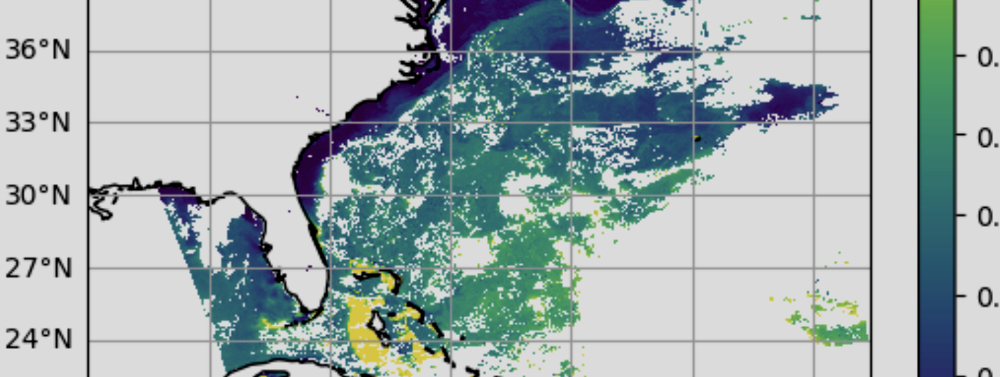
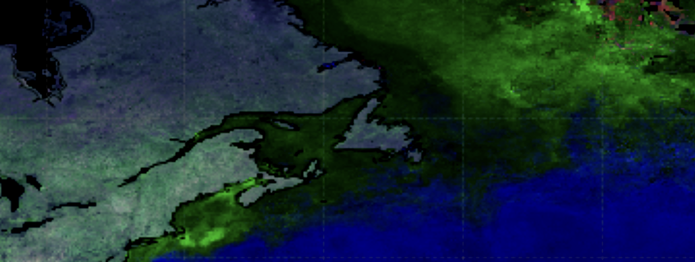
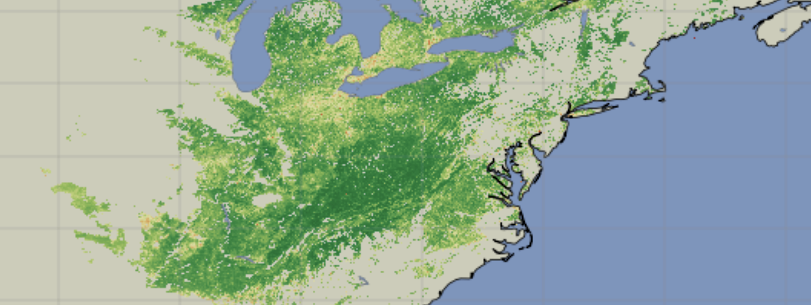
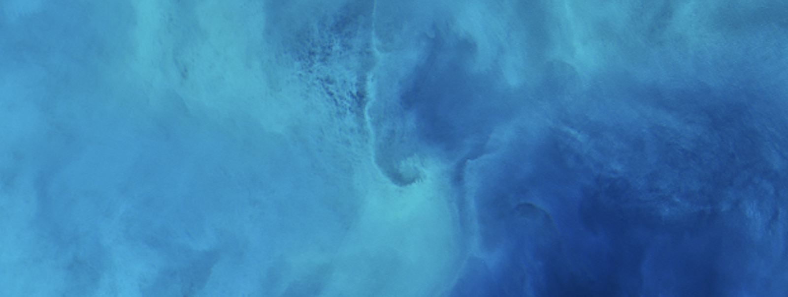

---
jupyter:
  jupytext:
    cell_metadata_filter: all,-trusted
    notebook_metadata_filter: -all,kernelspec,jupytext
    text_representation:
      extension: .md
      format_name: markdown
      format_version: '1.3'
      jupytext_version: 1.16.7
  kernelspec:
    display_name: Python 3 (ipykernel)
    language: python
    name: python3
---

<!-- #region -->
# Satellite data processing can be difficult.
## We're here to help you climb out of that hole!

This constantly updated collection of Jupyter notebooks is meant to help you get started accessing, visualizing, and analyzing
OB.DAAC (Ocean Biology Distributed Archive Center) data products with Python. You can learn from these notebooks either by viewing the code and results on this
webpage or by downloading the notebook files and running them with [JupyterLab][jupyterlab]. If you
plan to run any of these notebooks, please continue to the next section for information about the Earthdata Cloud and environments in Python. If you are familiar with running our notebooks, feel free to explore the Help Hub's different sections: 

### Help Hub Core
Explore these themes to get essential skills to access, process and visualize data.

::::{grid} 1 2 2 3
:gutter: 2

:::{grid-item-card} 
:link: sections/data-access-basics
:link-type: doc
**Data Basics**
^^^

Learn fundamentals of accessing and processing data products.
+++
Learn More →
:::

:::{grid-item-card} 
:link: sections/visualizations
:link-type: doc

**Visualizations**
^^^

Find out how to make visualizations with data from various instruments
+++
Learn More →
:::

:::{grid-item-card}
:link: sections/cloud-atmosphere
:link-type: doc
**Cloud & Atmosphere**
^^^

Explore atmospheric and cloud data products including aerosol retrievals and trace gases.

+++
Learn More →
:::

:::{grid-item-card} 
:link: sections/land
:link-type: doc
**Land Surface**
^^^

Work with terrestrial data products for monitoring vegetation and land cover.
+++
Learn More →
:::

:::{grid-item-card} 
**COMING SOON - Ocean**
^^^

Dive deeper into ocean data products.
+++
Coming soon
:::

::::

### SeaDAS - OCSSW Toolbox

:::{card}
:link: sections/seadas-toolbox
:link-type: doc

Learn how to use the official software of the OB.DAAC for analysis and visualization of remote sensing data.

+++
Learn More →
:::

### Past trainings & events
:::{card}
:link: sections/past-trainings
:link-type: doc
Find the tutorials from past trainings and events
+++
See all events →
:::

[jupyterlab]: https://jupyter.org/
<!-- #endregion -->
