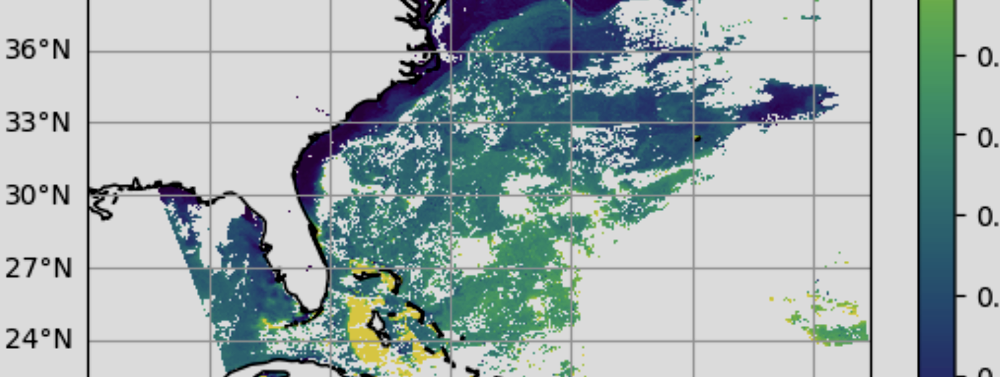
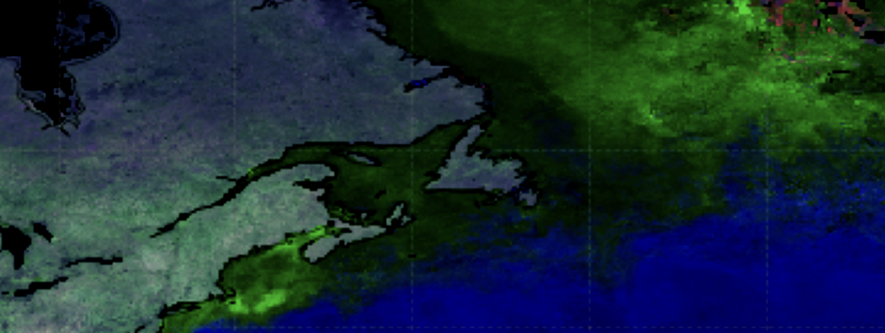
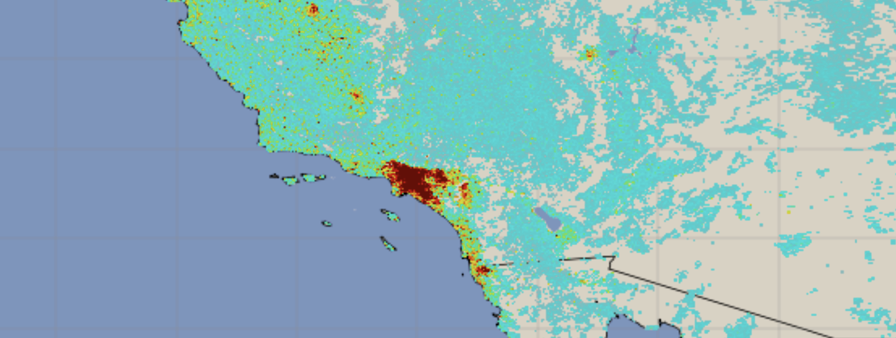
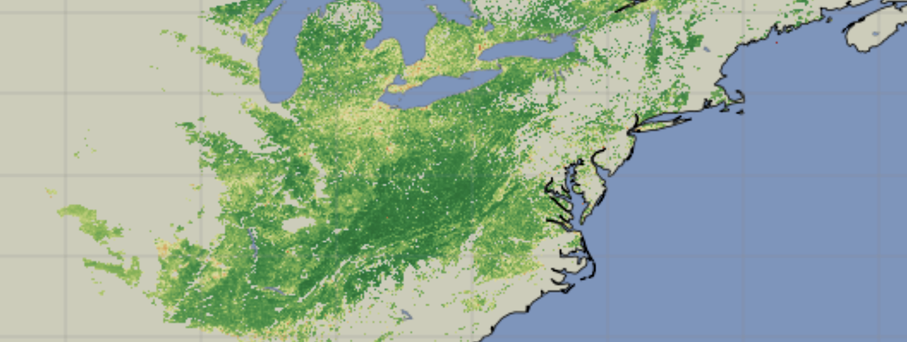
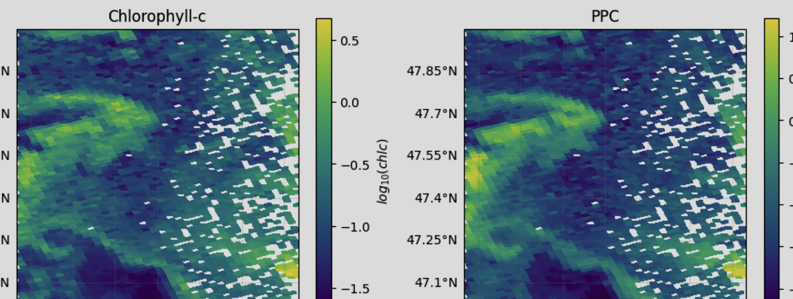
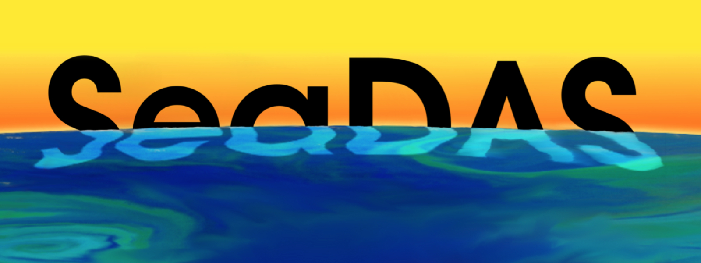
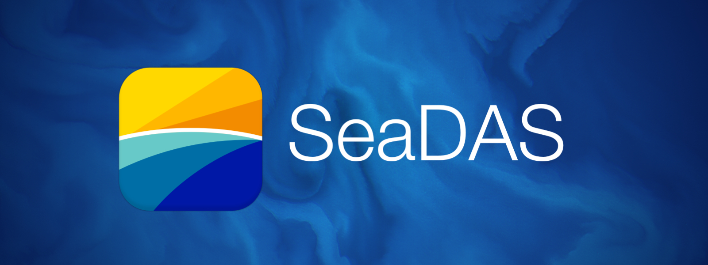

# Satellite data processing can be difficult.

<h2>We're here to help you climb out of that hole!</h2>

This constantly updated collection of Jupyter notebooks is meant to help you get started accessing, visualizing,
and analyzing OB.DAAC (Ocean Biology Distributed Active Archive Center) data products with Python.
You can learn from these notebooks either by viewing the code and results on this webpage,
or by downloading a notebook file, using the {fas}`download` menu in the upper right to get the {fas}`file` .ipynb file,
and running it with [JupyterLab][jupyterlab]. If you plan to run any of these notebooks but don't know how to start,
please continue to the Getting Started section for information about the Earthdata Cloud and environments in Python.  

We welcome your input! If you have suggestions
for new notebooks or ideas to improve existing ones, please share them by creating an
[issue](https://github.com/nasa/oceandata-notebooks/issues) or sending an email
to [carina.poulin@nasa.gov](mailto:carina.poulin@nasa.gov).

⚠️ Recent data reprocessings have introduced updates to file structures, variable names, and data organization that may impact existing workflows and notebooks. If previously working code no longer runs as expected, please review the [Reprocessing Notes](https://nasa.github.io/oceandata-notebooks/notebooks/release_note_highlights.html) tutorial. This resource highlights key changes, explains their impacts on common workflows, and provides examples for updating code to ensure compatibility with the latest data products.

If you are familiar with running our notebooks, feel free to explore the Help Hub's different sections:

## Help Hub Core

Explore these themes to get essential skills to access, process and visualize data.

::::{grid} 1 2 2 3
:gutter: 2

:::{grid-item-card}
:link: sections/data-access-basics
:link-type: doc
**Data Basics**
^^^

Learn fundamentals of accessing and processing data products.
+++
Learn More →
:::

:::{grid-item-card}
:link: sections/visualizations
:link-type: doc

**Visualizations**
^^^

Find out how to make visualizations with data from various instruments
+++
Learn More →
:::

:::{grid-item-card}
:link: sections/cloud-atmosphere
:link-type: doc
**Cloud & Atmosphere**
^^^

Explore atmospheric and cloud data products including aerosol retrievals and trace gases.

+++
Learn More →
:::

:::{grid-item-card}
:link: sections/land
:link-type: doc
**Land Surface**
^^^

Work with terrestrial data products for monitoring vegetation and land cover.
+++
Learn More →
:::

:::{grid-item-card}
:link: sections/ocean
:link-type: doc
**Ocean**
^^^

Dive deeper into ocean data products.
+++
Learn More →
:::

::::

## SeaDAS - OCSSW Toolbox

::::{grid} 1 2 2 2
:gutter: 2

:::{grid-item-card}
:link: sections/seadas-desktop
:link-type: doc
**SeaDAS Videos**
^^^

Learn how to use the official software of the OB.DAAC for analysis and visualization of remote sensing data with these videos.
+++
Learn More →
:::

:::{grid-item-card}
:link: sections/seadas-toolbox
:link-type: doc
**SeaDAS-OCSSW Notebooks**
^^^

Use this series of Jupyter Notebooks to learn to use the SeaDAS-OCSSW tools.
+++
Learn More →
:::
::::

## Past Trainings & Events

:::{card}
:link: sections/past-trainings
:link-type: doc
Find the tutorials from past trainings and events
+++
See all events →
:::

[jupyterlab]: https://jupyter.org/
