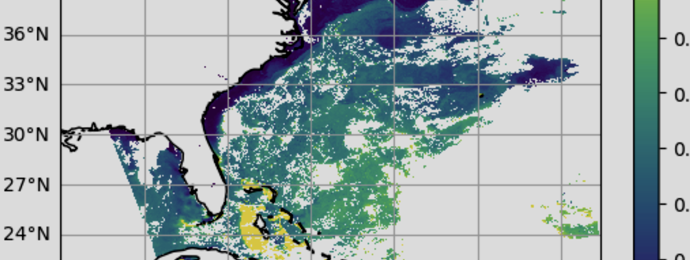
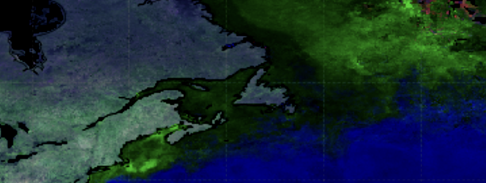
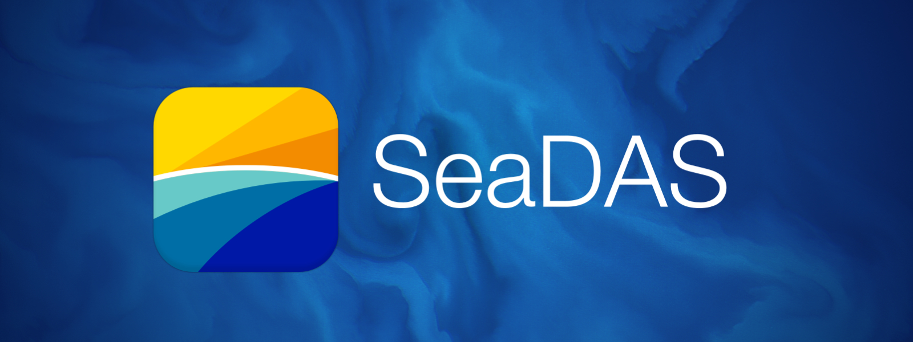
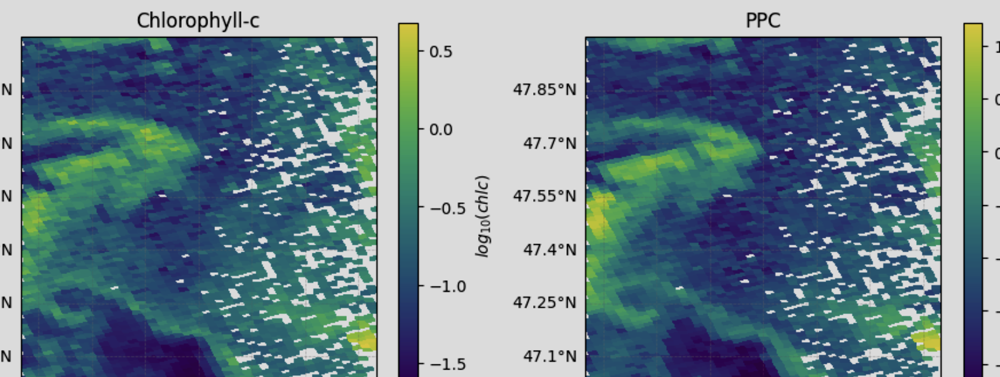
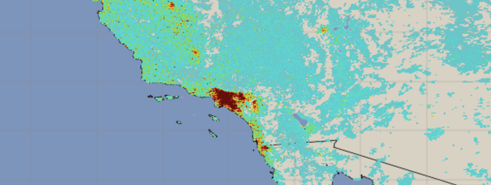
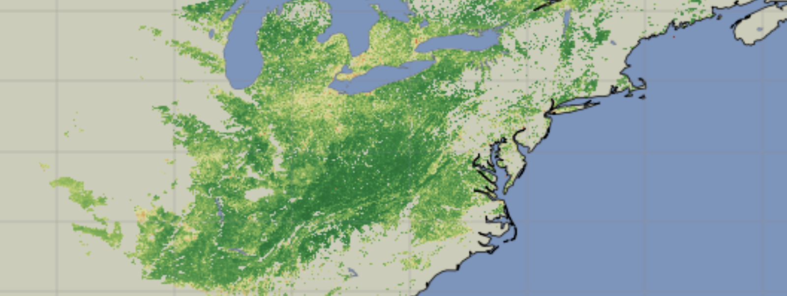

---
site:
  hide_toc: true
  hide_outline: true
  hide_title_block: true
---

+++ { "kind": "justified"}

## Satellite data processing can be difficult.

## We're here to help you climb out of that hole!

This constantly updated collection of Jupyter notebooks is meant to help you get started accessing, visualizing,
and analyzing OB.DAAC (Ocean Biology Distributed Active Archive Center) data products with Python or SeaDAS.

::::{grid} 1 2 2 2

:::{seealso} Welcome

Learn from these notebooks by viewing the code and results on this webpage, or download the code as a notebook. Click the {fas}`download` icon in the upper right of each page to download a {fas}`file` .ipynb file that you can open with {term}`JupyterLab`. If you plan to run any of these notebooks but don't know how to start, let us help you [get started](./getting-started.md) with the Earthdata Cloud and environments in Python.

:::

:::{attention}

Recent updates to file structures, variable names, and data organization may impact existing workflows and notebooks. If previously working code no longer runs as expected, please see our [reprocessing notes](./notebooks/release_note_highlights.md) tutorial. We highlight key changes, explain their impacts on common workflows, and provide examples for updating code to ensure compatibility with the latest data product version.

:::
::::

### Basics: core concepts and skills for every data user

::::{grid} 1 2 2 4
:gutter: 2

:::{card}
:link: sections/data-access
:link-type: doc
:header: Data Access
:footer: Learn More →

Learn the fundamentals of accessing OB.DAAC data products.

:::

:::{card}
:link: sections/processing
:link-type: doc
:header: Processing
:footer: Learn More →

Begin to process data products for your analyses and pipelines.

:::

:::{card}
:link: sections/visualization
:link-type: doc
:header: Visualization
:footer: Learn More →

Find out how to make visualizations with data from various instruments

:::

:::{card}
:link: sections/seadas
:link-type: doc
:header: SeaDAS & OCSSW
:footer: Learn More →

The official software created by the OB.DAAC for satellite data.

:::

::::

### Domains: approaches for your Earth science speciality

::::{grid} 1 2 2 3
:gutter: 2

:::{card}
:link: sections/ocean
:link-type: doc
:header: Ocean
:footer: Learn More →

Dive deeper into ocean data products.

:::

:::{card}
:link: sections/cloud-atmosphere
:link-type: doc
:header: Atmosphere
:footer: Learn More →

Explore atmospheric and cloud data products including aerosol retrievals and trace gases.

:::

:::{card}
:link: sections/land
:link-type: doc
:header: Terrestrial
:footer: Learn More →

Work with terrestrial data products for monitoring vegetation and land cover.

:::

::::

### Other Pages

::::{grid} 1 1 3 3

:::{card}
:link: ./faq

Frequently Asked Questions about data and tools

:::

:::{card}
:link: ./sections/other-useful-tutorials

Websites by friends of the Ocean Ecology Lab

:::

:::{card}
:link: sections/past-trainings

Tutorials from past trainings and events

:::

::::

:::{hint} Feedback & Suggestions

We welcome your input! If you have suggestions for new notebooks or ideas to improve
existing ones, please share them by creating an
[issue](https://github.com/nasa/oceandata-notebooks/issues) or sending an email
to [carina.poulin@nasa.gov](mailto:carina.poulin@nasa.gov).

:::

[jupyterlab]: https://jupyter.org/
