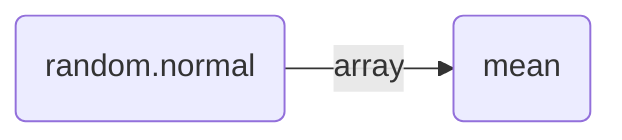
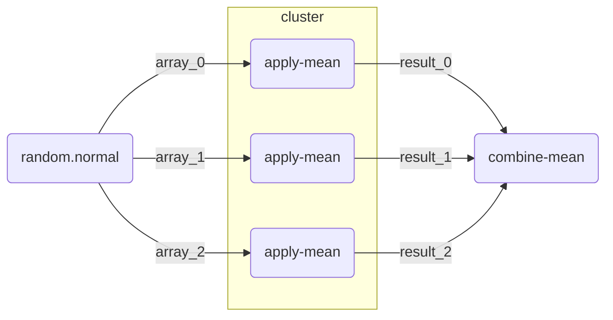

---
jupytext:
  text_representation:
    extension: .md
    format_name: myst
    format_version: 0.13
    jupytext_version: 1.17.2
kernelspec:
  name: python3
  display_name: Python 3 (ipykernel)
  language: python
---

# Parallel and Larger-than-Memory Processing

**Authors:** Ian Carroll (NASA, UMBC)

<div class="alert alert-success" role="alert">

The following notebooks are **prerequisites** for this tutorial.

- Learn with OCI: [Data Access][oci-data-access]
- Learn with OCI: [Processing with Command-line Tools][oci-ocssw-processing]
- Learn with OCI: [Project and Format][oci_project_and_format]

</div>

## Summary

Processing a large collection of PACE granules can seem like a big job!
The best way to approach a big data processing job is by breaking it into many small jobs, and then putting all the pieces back together again.
The reason we break up big jobs has to do with computational resources, specifically memory (i.e. RAM) and processors (i.e. CPUs or GPUs).
That large collection of granules can't all fit in memory; and even if it could, your computation might only use one processor.

This notebook works toward a better understanding of a tool tightly integrated with XArray that breaks up big jobs.
The tool is [Dask: a Python library for parallel and distributed computing][dask].

<!-- TODO: elaborate on Dask -->

## Learning Objectives

At the end of this notebook you will know:

- About the framework we're calling "chunk-apply-combine"
- How to start a `dask` client for parallel and larger-than-memory pipelines
- One method for averaging Level-2 "swath" data over time

## Contents

1. [Setup](#1.-Setup)
1. [Chunk-Apply-Combine](#2.-Chunk-Apply-Combine)
1. [Dask Workers](#3.-Dask-Workers)
1. [Level-2 Averaging](#4.-Level-2-Averaging)
1. [Scaling Out](#5.-Scaling-Out)

[oci-data-access]: https://oceancolor.gsfc.nasa.gov/resources/docs/tutorials/notebooks/oci_data_access
[oci-ocssw-processing]: https://oceancolor.gsfc.nasa.gov/resources/docs/tutorials/notebooks/oci-ocssw-processing
[oci_project_and_format]: https://oceancolor.gsfc.nasa.gov/resources/docs/tutorials/notebooks/oci_project_and_format

[dask]: https://docs.dask.org

+++

## 1. Setup

Begin by importing all of the packages used in this notebook. If your kernel uses an environment defined following the guidance on the [tutorials] page, then the imports will be successful.

[tutorials]: https://oceancolor.gsfc.nasa.gov/resources/docs/tutorials/

```{code-cell} ipython3
import cartopy.crs as ccrs
import dask.array as da
import earthaccess
import matplotlib.pyplot as plt
import numpy as np
import xarray as xr
from dask.distributed import Client
from matplotlib.patches import Rectangle
```

We will discuss `dask` in more detail below, but we use several additional packages behind-the-scenes. They are installed, but we don't have to import them directly.
- `rasterio` is a high-level wrapper for GDAL which provides the ability to "warp" with the type of geolocation arrays distributed in Level-2 data.
- `rioxarray` is a wrapper that attaches the `rasterio` tools to XArray data structures

[SatPy](https://satpy.readthedocs.io/) is another Python package that could be useful for the processing demonstrated in this notebok, especially through its [Pyresample](https://pyresample.readthedocs.io/) toolking. SatPy requires dedicated readers for any given instrument, however, and we have not tested the [SatPy reader contributed for PACE/OCI].

The data used in the demonstration is the `chlor_a` product found in the BGC suite of Level-2 ocean color products from OCI.

[SatPy reader contributed for PACE/OCI]: https://satpy.readthedocs.io/en/stable/api/satpy.readers.pace_oci_l1b_nc.html

```{code-cell} ipython3
bbox = (-77, 36, -73, 41)
results = earthaccess.search_data(
    short_name="PACE_OCI_L2_BGC",
    temporal=("2024-08-01", "2024-08-07"),
    bounding_box=bbox,
)
len(results)
```

The search results include all granules from launch through July of 2024 that intersect a bounding box around the Chesapeake and Delaware Bays. The region is much smaller than an OCI swath, so we do not use the cloud cover search filter which considers the whole swath.

```{code-cell} ipython3
results[0]
```

```{code-cell} ipython3
paths = earthaccess.open(results[:1])
```

```{code-cell} ipython3
datatree = xr.open_datatree(paths[0])
```

```{code-cell} ipython3
dataset = xr.merge(datatree.to_dict().values())
dataset = dataset.set_coords(("latitude", "longitude"))
chla = dataset["chlor_a"]
chla
```

As a reminder, the Level-2 data has latitude and longitude arrays that give the geolocation of every pixel. The `number_of_line` and `pixels_per_line` dimensions don't have any meaningful coordinates that would be useful for stacking Level-2 files over time.  In a lot of the granules, like the one visualized here, there will be a tiny amount of data within the box. But we don't want to lose a single pixel (if we can help it)!

```{code-cell} ipython3
fig = plt.figure(figsize=(8, 4))
axes = fig.add_subplot()
chla.plot.pcolormesh(x="longitude", y="latitude", robust=True, ax=axes)
axes.add_patch(
    Rectangle(
        bbox[:2],
        bbox[2] - bbox[0],
        bbox[3] - bbox[1],
        edgecolor="red",
        facecolor="none",
    )
)
axes.set_aspect("equal")
plt.show()
```

Here is where we first use `rasterio` and `rioxarray`.
Those packages together add the `rio` attribute to the `chla` dataset which allows us to go GDAL processing in Python.
GDAL requires certain metadata that `rio` records for us, but it needs to know some information!
The Level-2 file uses the EPSG 4326 coordinate reference system, and the spatial dimensions are:

1. x (or longitude for EPSG 4326) is "pixels_per_line"
1. y (or latitude for EPSG 4326) is "number_of_lines"

```{code-cell} ipython3
chla = chla.rio.set_spatial_dims("pixels_per_line", "number_of_lines")
chla = chla.rio.write_crs("epsg:4326")
```

We can now use the `reproject` method to grid the L2 data into something like a Level-3 Mapped product, but for a single granule.

```{code-cell} ipython3
chla_L3M = chla.rio.reproject(
    dst_crs="epsg:4326",
    src_geoloc_array=(
        chla.coords["longitude"],
        chla.coords["latitude"],
    ),
)
chla_L3M = chla_L3M.rename({"x":"longitude", "y":"latitude"})
```

The plotting can now be done with `imshow` rather than `pcolormesh`.

```{code-cell} ipython3
plot = chla_L3M.plot.imshow(robust=True)
```

Also, we can easilly select the area-of-interest using our bounding box.
This smaller data array will become our "template" for gridding additional granules below.

```{code-cell} ipython3
chla_L3M_aoi = chla_L3M.sel(
    {
        "longitude": slice(bbox[0], bbox[2]),
        "latitude": slice(bbox[3], bbox[1]),
    },
)
plot = chla_L3M_aoi.plot.imshow(robust=True)
```

When we get to opening mulitple datasets, we will use a helper function to create a "time" coordinate extracted from metadata.

```{code-cell} ipython3
def time_from_attr(ds):
    """Set the start time attribute as a dataset variable.

    Parameters
    ----------
    ds
        a dataset corresponding to a Level-2 granule
    """
    datetime = ds.attrs["time_coverage_start"].replace("Z", "")
    ds["time"] = ((), np.datetime64(datetime, "ns"))
    ds = ds.set_coords("time")
    return ds
```

Before we get to data, we will play with some random numbers. Whenever you use random numbers, a good practice is to set a fixed but unique seed, such as the result of `secrets.randbits(64)`.

```{code-cell} ipython3
random = np.random.default_rng(seed=5179916885778238210)
```

[back to top](#contents) <a name="section-name"></a>

+++

## 3. Chunk-Apply-Combine

If you've done big data processing, you've probably come across the "split-apply-combine" or "map-reduce" frameworks.
A simple case is computing group-wise means on a dataset where one variable defines the group and another variable is what you need to average for each group.

1. **split**: divide a table into smaller tables, one for each group
2. **apply**: calculte the mean on each small table
3. **combine**: reassemble the results into a table of group-wise means

The same framework is also used without a natural group by which a dataset should be divided.
The split is on equal-sized slices of the original dataset, which we call "chunks".
Rather than a group-wise mean, you could use "chunk-apply-combine" to calculate the grand mean in chunks.

1. **chunk**: divide the array into smaller arrays, or "chunks"
2. **apply**: calculate the mean and sample size of each chunk (i.e. skipping missing values)
3. **combine**: combine the size-weighted means to compute the mean of the whole array

The apply and combine steps have to be capable of calculating results on a slice that can be combined to equal the result you would have gotten on the full array. If a computation can be shoved through "chunk-apply-combine" (see also "map-reduce"), then we can process an array that is too big to read into memory at once. We can also distribute the computation across processors or across a cluster of computers.

We can represent the framework visually using a task graph, a collection of functions (nodes) linked through input and output data (edges).

<!-- TODO: functions imported form numpy vs imported from dask -->

+++



+++

The output of the `random.normal` function becomes the input to the `mean` function. We can decide to use chunk-apply-combine
if either:

1. `array` is going to be larger than available memory
1. `mean` can be accurately calculated from intermediate results on slices of `array`

+++

By the way, `numpy` arrays have an `nbytes` attribute that helps you understand how much memory you may need. Note tha most computations require several times the size of an input array to do the math.

```{code-cell} ipython3
array = random.normal(1, 2, size=2**24)
array
```

```{code-cell} ipython3
print(f"{array.nbytes / 2**20} MiB")
```

It's still not too big to fit in memory on most laptops. For demonstration, let's assume we could fit a 128 MiB array into memory, but not a 1 GiB array. We will calculate the mean of a 1 GiB array anyway, using 8 splits each of size 128 MiB in a serial pipeline.

A simple way to measure performance (i.e. speed) in notebooks is to use the [IPython %%timeit magic][timeit].
Begin any cell with `%%timeit` on a line by itself to trigger that cell to run many times under a timer.
How long it takes the cell to run on average will be printed along with any result.

On this system, the serial approach can be seen below to take between 2 and 3 seconds.

[timeit]: https://ipython.readthedocs.io/en/stable/interactive/magics.html#magic-timeit

```{code-cell} ipython3
%%timeit -r 3

n = 8
s = 0
for _ in range(n):
    array = random.normal(1, 2, size=2**24)
    s += array.mean()
mean = s / n
```

All we can implement in a for-loop is serial computation, but we have multiple processors available!

To help visualize the "chunk-apply-combine" framework, we can make a task graph for the "distributed" approach to calculating the mean of a very large array.

+++



+++

In this task graph, the `mean` function is never used! Instead an `apply-mean` function and `combine-mean` functions are used to perform the appropriate computations on chunks and then combine the results to the global mean.

The two things that `dask` provides is the `cluster` that distributes jobs for computation as well as many functions (i.e. like `apply-mean` and `combine-mean`) that are the "chunk-apply-combine" equivalents of `numpy` functions.

To begin processing with `dask`, we start a local `client` to manage a `cluster`.

```{code-cell} ipython3
client = Client(n_workers=4, threads_per_worker=1, memory_limit="512MiB")
client
```

Just like `np.random`, we can use `da.random` from `dask` to generate a data array.

```{code-cell} ipython3
:scrolled: true

dask_random = da.random.default_rng(random)
dask_array = dask_random.normal(1, 2, size=2**27, chunks=2**22)
dask_array
```

Apply the `mean` function with out `dask_array` is quite a bit different.

```{code-cell} ipython3
dask_array.mean()
```

No operation has happened on the array. In fact, the random numbers have not even been generated yet!
No resources are put into action until we explicitly demand a computation; for example, by calling `compute`, requesting a visualization, or writing data to disk.

```{code-cell} ipython3
%%timeit -r 3

mean = dask_array.mean().compute()
```

We just demonstrated two ways of doing larger-than-memory calculations.

Our synchronous implemenation (using a for loop) took the strategy of maximizing the use of available memory while processing one chunk: so we used 128 MiB chunks, requiring 8 chunks to get to a 1 GiB array.

Our concurrent implementation (using `dask.array`), took the strategy of maximizing the use of available processors: so we used small chunks of 32 MiB, requiring 32 to get to a 1 GiB array.

The concurrent implementation was about twice as fast, but your mileage may vary.

```{code-cell} ipython3
client.close()
```

## 4. Stacking Level-2 Granules

The integration of XArray and Dask is designed to let you work without doing much very differently.
Of course, there is still a lot of work to do when writing any processing pipeline on a collection of Level-2 granules.
Stacking them over time, for instance, may sound easy but requires resampling the data to a common grid.

This section demonstrates one method for stacking Level-2 granules.
More details are available in the pre-requiste notebook noted above.

```{code-cell} ipython3
paths = earthaccess.open(results)
```

```{code-cell} ipython3
paths
```

```{code-cell} ipython3
kwargs = {"combine": "nested", "concat_dim": "time"}
attrs = xr.open_mfdataset(paths, preprocess=time_from_attr, **kwargs)
attrs
```

Now, if you try `xr.open_mfdataset` you will probably encounter an error due to the fact that the `number_of_lines` is not the same in every granule.

```{code-cell} ipython3
:scrolled: true
:tags: [raises-exception]

products = xr.open_mfdataset(paths, group="geophysical_data", **kwargs)
```

Even if they were consistent, each granule has a different array of coordinates for latitude and longitude.
Before doing a calculation over time, we need to project the Level-2 arrays to a common grid.
Here is a function to do the same kind of gridding as above, but allowing us to pass the "destination" (.i.e. `dst`)
projection parameters.

```{code-cell} ipython3
def grid_match(path, dst_crs, dst_shape, dst_transform):
    """Reproject a Level-2 granule to match a Level-3M-ish granule."""
    dt = xr.open_datatree(path)
    da = dt["geophysical_data"]["chlor_a"]
    da = da.rio.set_spatial_dims("pixels_per_line", "number_of_lines")
    da = da.rio.set_crs("epsg:4326")
    da = da.rio.reproject(
        dst_crs,
        shape=dst_shape,
        transform=dst_transform,
        src_geoloc_array=(
            dt["navigation_data"]["longitude"],
            dt["navigation_data"]["latitude"],
        ),
    )
    da = da.rename({"x":"longitude", "y":"latitude"})
    return da
```

Let's try out the function, using `chla_L3M_aoi` as our template.

```{code-cell} ipython3
crs = chla_L3M_aoi.rio.crs
shape = chla_L3M_aoi.rio.shape
transform = chla_L3M_aoi.rio.transform()

grid_match(paths[0], crs, shape, transform)
```

Now that we have encapusulated our processing in a function, we can use `dask` to distribute computation.
As before, we need a `client`.

```{code-cell} ipython3
client = Client()
client
```

Call `client.map` to send `grid_match` to the `cluster` and prepare to run it independently on each elements of `paths`.

```{code-cell} ipython3
futures = client.map(
    grid_match,
    paths,
    dst_crs=crs,
    dst_shape=shape,
    dst_transform=transform,
)
futures
```

The `futures` will remain `pending` until the tasks have been completed on the `cluster`.
You don't need to wait for them; the next call to `client.gather` will wait for the results.

These results can now be easilly stacked

```{code-cell} ipython3
chla = xr.combine_nested(client.gather(futures), concat_dim="time")
chla["time"] = attrs["time"]
chla
```

```{code-cell} ipython3
plot = chla.mean("time").plot.imshow(robust=True)
```

```{code-cell} ipython3
client.close()
```

[back to top](#contents)

+++

## 5. Scaling Out

+++

The example above relies on a `LocalCluster`, which only uses the resources on the JupyterLab server running your notebook.
The promise of the commercial cloud is massive scalability.
Again, `dask` and the CryoCloud come to our aid in the form of a pre-configured `dask_gateway.Gateway`.
The `gateway` object created below works with the CryoCloud to launch additional servers,
and now those servers are enlisted in your `cluster`.

```{code-cell} ipython3
from dask_gateway import Gateway
```

```{code-cell} ipython3
gateway = Gateway()
options = gateway.cluster_options()
options
```

```{code-cell} ipython3
cluster = gateway.new_cluster(options)
cluster
```

The cluster starts with no workers, and you must set manual or adaptive scaling in order to get any workers.

<div class="alert alert-warning" role="alert">

The cluster can take several minutes to spin up. Monitor the dashboard to ensure you have workers.

</div>

```{code-cell} ipython3
client = cluster.get_client()
client
```

Use this client exactly as above:

+++

```
futures = client.map(
    grid_match,
    paths,
    dst_crs=crs,
    dst_shape=shape,
    dst_transform=transform,
)
```

+++

```
chla = xr.combine_nested(client.gather(futures), concat_dim="time")
chla["time"] = attrs["time"]
chla
```

```{code-cell} ipython3
cluster.close()
```

[back to top](#contents)
