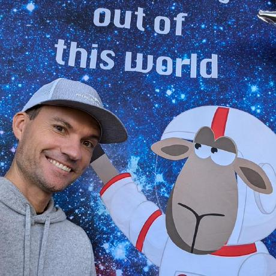
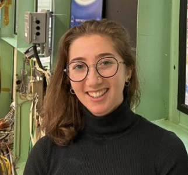

---
jupyter:
  jupytext:
    cell_metadata_filter: all,-trusted
    notebook_metadata_filter: -all,kernelspec,jupytext
    text_representation:
      extension: .md
      format_name: markdown
      format_version: '1.3'
      jupytext_version: 1.16.7
  kernelspec:
    display_name: Python 3 (ipykernel)
    language: python
    name: python3
---

# Help Hub Team

::::{grid} 2 3 4 4
:gutter: 2

:::{grid-item-card}
:text-align: center
:link: https://science.gsfc.nasa.gov/earth/oceanecology/bio/carina.poulin

+++
**Carina Poulin**
:::

:::{grid-item-card}
:text-align: center
:link: https://ael.gsfc.nasa.gov/sci/bio/anna.e.windledipaola

+++
**Anna Windle**
:::

:::{grid-item-card}
:text-align: center
:link: https://ael.gsfc.nasa.gov/sci/bio/ian.t.carroll

+++
**Ian Carroll**
:::

:::{grid-item-card}
:text-align: center
:link: https://science.gsfc.nasa.gov/sci/bio/sean.r.foley

+++
**Sean Foley**
:::

:::{grid-item-card}
:text-align: center
:link: https://science.gsfc.nasa.gov/sci/bio/morgaine.mckibben

+++
**Morgaine McKibben**
:::

:::{grid-item-card}
:text-align: center
:link: https://science.gsfc.nasa.gov/earth/oceanecology/bio/skyelar.a.caplan

+++
**Skye Caplan**
:::

:::{grid-item-card}
:text-align: center
:link: https://science.gsfc.nasa.gov/sci/bio/guoqing.wang

+++
**Guoqing Wang**
:::

:::{grid-item-card}
:text-align: center
:link: https://science.gsfc.nasa.gov/earth/oceanecology/bio/james.g.allen-1

+++
**James Allen**
:::

:::{grid-item-card}
:text-align: center
:link: https://science.gsfc.nasa.gov/sci/bio/alicia.m.scott

+++
**Alicia M. Scott**
:::

:::{grid-item-card}
:text-align: center
:link: https://science.gsfc.nasa.gov/sci/bio/90238

+++
**Bing Yang**
:::

:::{grid-item-card}
:text-align: center
:link: https://science.gsfc.nasa.gov/sci/bio/daniel.s.knowles

+++
**Daniel S. Knowles**
:::

:::{grid-item-card}
:text-align: center
:link: https://science.gsfc.nasa.gov/earth/oceanecology/bio/michael.a.maniscalco

+++
**Michael Maniscalco**
:::

::::
